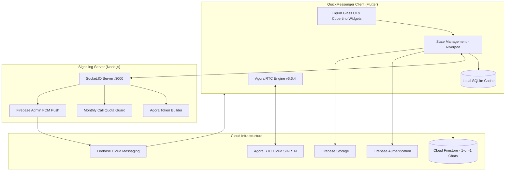

# QuickMessenger 🚀

[](https://flutter.dev)
[](https://www.agora.io)
[](https://socket.io)
[](https://firebase.google.com)
[](https://www.sqlite.org)

A production-grade, real-time messaging, community, and audio/video calling application built with Flutter, powered by a custom Node.js Socket.IO signaling server, Cloud Firestore hybrid synchronization, and Agora RTC Engine. QuickMessenger is crafted with an authentic **WhatsApp iOS "Liquid Glass" design system** featuring real-time gaussian blur effects, floating capsule navigation, and a signature **iOS Sapphire Blue** accent.

---

## 🌟 Highlights & Key Features

### 💎 WhatsApp iOS "Liquid Glass" UI System
- **Floating Capsule Navigation (`LGBottomBar`)**: Floating dock with 24px gaussian `BackdropFilter` blur, specular border reflections, active glowing indicator pills, unread badges, and a live user avatar on the **"You"** tab.
- **Header & Action Surfaces (`LGAppBar` & `LGPanel`)**: Glassmorphic app bars and multi-level frosted containers (Levels 1–4) delivering authentic Apple depth.
- **iOS Aligned Action Sheets (`LGActionSheet`)**: Custom frosted modal sheets featuring strictly left-aligned leading icons (28×28 icon box), 15pt medium typography, and destructive confirmations.
- **Curated Deterministic Avatars (`UserAvatar`)**: 24 vibrant gradient color palettes hashed deterministically by user/contact ID seeds with specular glass rim highlights.
- **Search Experience (`LGSearchField`)**: Pill-shaped glass search bar adorned with an iridescent Meta AI-style gradient border ring.
- **OLED Dark & Light Modes**: Context-aware color tokens and dynamic contrast palettes (`AppColors`).

### 💬 Instant Messaging & Hybrid Data Architecture
- **Single-Chat Cloud Sync (Firestore)**: 1-to-1 chats automatically sync to Firebase Cloud Firestore (`Users/{uid}/save_chat/{peer}/messages` & `Users/{uid}/chats`), providing seamless cross-device persistence and cloud backups.
- **Strictly Local Storage (SQLite)**: Groups, group messages, member rosters, call history, message drafts, and cached media reside **exclusively in local SQLite**, cutting cloud costs while ensuring instantaneous offline access.
- **Real-Time Delivery & Status**: Real-time read receipts (sent, delivered, read), typing indicators, and online presence tracking via Socket.IO.
- **Rich Chat Interactions**:
  - Floating reply preview banners with one-tap quote dismissal.
  - Interactive tapback emoji reaction picker.
  - Multi-type media attachments (Camera, Photo Gallery, Documents).
  - WhatsApp-style calendar date pill separators (`_DatePill`).
  - Full-text conversation history search.

### 👥 Communities & Group Management
- Offline-first group chats with SQLite persistence and real-time Socket.IO broadcasts.
- Owner vs. member permission matrices (owners have group deletion rights; members have exit capabilities).
- Cascade deletion handling removing local SQLite tables and cleaning cloud assets.

### 📞 Voice & Video Calling (Agora RTC Engine v6.6.4)
- **Token-Authenticated RTC Channels**: Secure, server-minted 24-hour Agora RTC tokens generated dynamically upon call initiation.
- **Zero-Minute Ringing Architecture**:
  - The caller **never** joins the Agora channel while the recipient's device is ringing.
  - Channels are joined strictly upon callee pickup (`onCallAnswer`), guaranteeing **0 Agora minutes** consumed on unanswered or rejected calls.
- **10,000 Free Monthly Minute Quota Safeguards**:
  - Server-side quota tracking blocks unauthorized call attempts with clear reset timestamps (`YYYY-MM-01`).
  - Client-side error interception alerts the user when quota limits are reached.
- **Lifecycle & Resource Protection**:
  - Swiping away/closing the app (`AppLifecycleState.detached`) automatically ends the call and releases hardware resources.
  - Backgrounding the app pauses camera tracks to eliminate bandwidth waste.
  - 40-second ringing timeout automatically cancels ghost calls.
  - Automatic call termination if the remote participant drops off (`onUserOffline`).

### 🔔 Firebase Cloud Messaging (FCM) & Resilient Routing
- **Background & Terminated Push Handling**: Background messaging handled via top-level `@pragma('vm:entry-point')` entrypoint.
- **Automatic Token Sync**: Firestore listener syncs the client's current device token directly to `Users/{uid}.fcmToken` upon authentication.
- **Cold-Start Deep Linking**: Tapping a push notification immediately navigates to that specific conversation (`ChatScreen`) with built-in mount retry and duplicate route suppression.
- **Backstack Safety**:
  - `PopScope` hardware back gesture interceptor.
  - If opened cold from a notification with an empty backstack, pressing back gracefully navigates to `HomeScreen` (`MainNavigationScreen`), ensuring all 5 tabs and features remain functional.

---

## 🏗️ Architecture & Technology Stack



| Layer | Technology |
|---|---|
| **Framework** | Flutter 3.x (Dart SDK `^3.5.4`) |
| **State Management** | Flutter Riverpod (`^2.5.1`) |
| **Design Tokens** | Custom Liquid Glass System (`liquid_kit: ^0.1.7`, Cupertino) |
| **Real-Time Signaling** | Socket.IO Client (`^3.1.6`) |
| **Voice & Video** | Agora RTC Engine (`^6.6.4`) |
| **Local Database** | SQLite via `sqflite` (`^2.2.4`) |
| **Backend Auth & Sync** | Firebase Auth (`^5.3.3`), Cloud Firestore (`^5.5.1`), Storage (`^12.3.7`) |
| **Push Notifications** | Firebase Cloud Messaging (`^15.2.10`), Flutter Local Notifications (`^22.0.1`) |
| **Signaling Backend** | Node.js, Express, Socket.IO, `agora-token`, `firebase-admin` |

---

## 📁 Project Structure

```
lib/
├── core/
│   ├── database/          # SQLite database helper & schema migrations (V6)
│   ├── network/           # HTTP & networking clients
│   ├── providers/         # Global auth & session Riverpod providers
│   ├── services/          # Agora call service, Socket.IO, notifications, navigation
│   ├── theme/             # Liquid Glass design tokens (colors, typography, spacing)
│   ├── utils/             # Network connectivity monitor
│   └── widgets/           # Liquid Glass UI components (LGBottomBar, LGAppBar, LGActionSheet...)
├── features/
│   ├── auth/              # Authentication screens (Login, Register, Gate, Reset)
│   ├── chat/              # 1-to-1 chats, group chats, calls, and message search
│   │   ├── models/        # Message, Conversation, Call, and Group models
│   │   ├── providers/     # Chat and messaging Riverpod state notifiers
│   │   ├── repositories/  # Hybrid Firestore & SQLite chat repository
│   │   ├── screens/       # ChatScreen, CallScreen, CallsTabScreen, MainNavigation...
│   │   └── widgets/       # Message bubbles, avatar widgets, input composer...
│   ├── notifications/     # Notifications center screen
│   ├── profile/           # User profile & follower management
│   ├── settings/          # Themes, linked devices, and account settings
│   └── splash/            # Animated startup splash screen
├── firebase_options.dart  # Generated Firebase environment options
└── main.dart              # Entrypoint, background handlers, and theme initialization
```

---

## 🚀 Getting Started

### Prerequisites
1. **Flutter SDK**: `>= 3.5.4` ([Install Flutter](https://docs.flutter.dev/get-started/install))
2. **Node.js**: `>= 18.x` for the signaling backend
3. **Firebase Project**: Configured with Authentication (Email/Password), Cloud Firestore, Cloud Storage, and FCM
4. **Agora Account**: App ID and App Certificate from the [Agora Console](https://console.agora.io/)

---

### Configuration & Setup

#### 1. Server Configuration (`Quick Messenger Server`)
In the server root, create a `.env` file:
```env
PORT=3000
FIREBASE_SERVICE_ACCOUNT=./serviceAccountKey.json
AGORA_APP_ID=your_agora_app_id
AGORA_APP_CERTIFICATE=your_agora_app_certificate
```
Install dependencies and run the server:
```bash
npm install
npm run dev
```

#### 2. Flutter App Configuration (`QuickMessenger`)
1. **Firebase**:
   - Place `google-services.json` inside `android/app/`.
   - Place `GoogleService-Info.plist` inside `ios/Runner/`.
   - Ensure `lib/firebase_options.dart` is populated.
2. **Socket Server Endpoint**:
   - Update the Socket.IO URL in `lib/core/services/socket_service.dart` with your local IP or backend URL.
3. **Dependencies**:
   ```bash
   flutter pub get
   ```
4. **Run Application**:
   ```bash
   flutter run
   ```

---

## 🧪 Quality & Verification

Run static code analysis to verify project integrity:
```bash
flutter analyze
```
> All analysis checks pass with **0 errors, 0 warnings, and 0 linter hints**.

---

## 📄 License
This project is licensed under the MIT License - see the LICENSE file for details.
